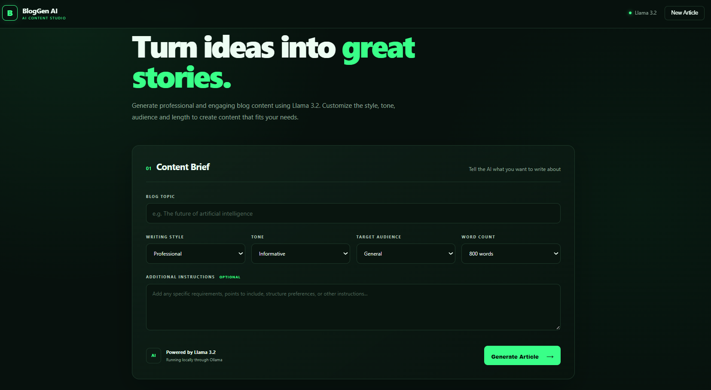

# BlogGen AI

An AI-powered Blog Content Generator built using **Python, Flask, Ollama, and Llama 3.2**.

## Aim

To build an AI-powered Blog Content Generator using Ollama and Llama 3.2.

## Problem Statement

Design and develop a web-based AI-powered blog content generator using Ollama. The system generates professional and engaging blog content based on the user's topic, writing style, tone, target audience, word count, and additional instructions using effective prompt engineering.

## Features

- AI-powered blog content generation
- Llama 3.2 integration through Ollama
- Custom writing style
- Custom tone selection
- Target audience customization
- Adjustable word count
- Additional instructions
- Prompt engineering
- Generated article formatting
- Copy generated article
- Professional dark-themed interface
- Local AI generation without external API dependency

## Technologies Used

- Python
- Flask
- HTML5
- CSS3
- JavaScript
- Ollama
- Llama 3.2

## System Modules

| Module | Responsibility |
|---|---|
| User Input Module | Collects topic, writing style, tone, target audience, word count, and additional instructions. |
| Prompt Engineering Module | Combines the user's inputs into a structured prompt for the LLM. |
| Blog Generation Module | Sends the prompt to Ollama and uses Llama 3.2 to generate the blog. |
| Response Formatting Module | Formats the generated content into a readable blog article. |
| User Interface Module | Displays the generated blog and provides options such as Copy Article and New Article. |

## How It Works

1. The user enters a blog topic.
2. The user selects the writing style and tone.
3. The target audience and word count are selected.
4. Additional instructions can be provided.
5. Flask receives the user's inputs.
6. The application creates a structured prompt using prompt engineering.
7. The prompt is sent to Llama 3.2 through Ollama.
8. Llama 3.2 generates the blog content locally.
9. The generated article is displayed in the web application.
10. The user can copy the generated article.

## Installation and Setup

### 1. Clone the Repository

```bash
git clone https://github.com/Sajin654/-BlogGen-AI.git
cd -BlogGen-AI
```
Screenshots
User Interface
<p align="center">  </p>
User Prompt
<p align="center">  </p>
Generated Blog Output
<p align="center">  </p>
